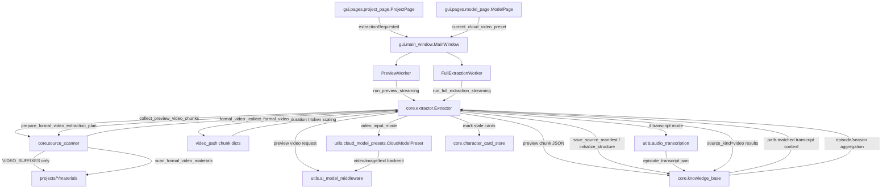
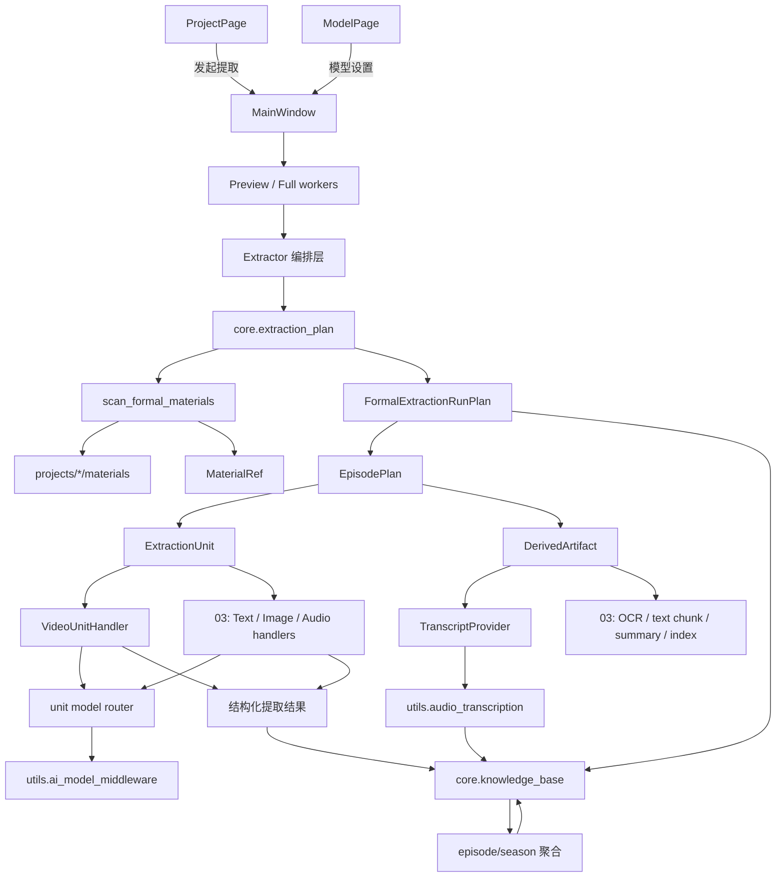

# 第二阶段：多媒体平级接入前重构解耦执行计划（zh_CN）

最近整理日期：2026-06-12

计划状态：已按二次代码审查重排。本文档取代旧版“兼容旧 manifest”的路线。

适用阶段：路线 02，在路线 01 提取质量与可观测性计划完成后、路线 03 多内容形态覆盖实施前执行。

执行闸门：业务代码重构前必须先记录当前真实结构和目标结构。当前结构、目标结构和里程碑经用户确认后，才能进入 M03 及后续代码重构。

## 1. 目的

当前正式提取链路已经能围绕视频素材完成预览、full、clean、fast 正式提取，并能写入分层知识库。但主流程仍把“视频 chunk”当成 Extract Once 的默认世界观：

- `core.source_scanner.scan_formal_video_materials()` 生成视频 manifest。
- `core.extractor.Extractor.run_full_extraction_streaming()` 调用 `prepare_formal_video_extraction_plan()`。
- `_collect_formal_video_chunk_inputs()` 从 manifest 中构造带 `video_path` 的 dict。
- `_extract_full_chunk_json_from_manifest()`、`_extract_fast_chunk_json_from_manifest()` 仍以 manifest 和 video chunk inputs 为主输入。
- transcript 由 `video_input_mode` 间接触发，仍像视频请求副作用。
- episode/season 聚合产物大量写入 `source_kind="video"`，来源追踪粒度不足。
- `scripts/validate_formal_extraction_workflow.py` 仍 mock 旧视频 plan 入口。
- 旧版 02 计划书仍写有“保留旧 manifest、扩展旧 `ExtractionRunPlan`、兼容旧字段”的路线。

路线 02 的目标是把正式提取从 video-manifest-driven 改为 plan-first：

- 用新的运行计划作为正式提取主事实源。
- 用 `MaterialRef`、`ExtractionUnit`、`DerivedArtifact`、`EvidenceRef` 表达素材、提取单元、派生成果和证据。
- 让旧 manifest、旧验证脚本、旧 `core.models.ExtractionRunPlan` 给新结构让路。
- 为路线 03 接入小说、漫画、图片、音频、字幕、台本、设定集等内容形态预留稳定接口。

路线 02 不负责真正接入这些新内容形态的完整提取能力。03 才负责多内容形态覆盖。

## 2. 范围

核心范围：

- 记录当前旧结构和目标新结构。
- 重排路线 02 里程碑，让后续执行围绕新 plan-first 架构展开。
- 新增 `core/extraction_plan.py` 或等价小模块。
- 定义顶层媒体类型、内容形态、素材引用、提取单元、派生成果、证据引用和来源追踪结构。
- 替换旧 manifest 作为正式提取主驱动。
- 同步调整验证脚本、测试数据和内部调用，避免旧测试反向约束新结构。
- 保持现有视频用户行为不退化。
- 为 03 的 text/image/audio/video handler、长文本切分、OCR、转写、索引等能力预留接口。

不做范围：

- 不在 02 中实现完整小说、漫画、图片、音频、字幕、台本正式提取。
- 不迁移用户项目数据。
- 不改变 `raw/`、`materials/`、`cache/`、`knowledge_base/`、`output/` 根目录语义。
- 不把预览产物默认升级为正式知识库事实。
- 不引入新依赖。
- 不做空泛插件系统或第三方扩展机制。
- 不让 GUI 层承载素材扫描、知识库写入或模型调用。
- 不绕过 `utils.ai_model_middleware`。
- 不恢复 `ProjectConfig.target_characters` 在新编译链路中的地位。

## 3. 已确认原则

- 顶层 `MediaType` 只允许 `video`、`image`、`audio`、`text`。
- `transcript` 不是第五种 `MediaType`。
- `transcript` 不是新的原始文本素材，而是从 `video/audio` 派生出的文本形态中间成果。
- 02 要抽出的不是 transcript 特例，而是通用派生成果层。
- 即使原始素材是纯文本，也可能需要派生成果，例如 `text_chunk`、`chapter_summary`、`semantic_index`。
- 旧 manifest 不再作为兼容约束；新结构优先。
- 测试数据、验证脚本和内部调用要跟随新结构调整。
- 来源追踪是硬约束，不能把不同来源混成单一 `source_kind`。
- 旧 `core.models.ExtractionRunPlan` 不能限制新运行计划模型。
- 每个里程碑只替换一条主要边界，尽量保持负载均衡。
- 用户可见行为优先保持稳定，代码结构优先向新架构收敛。

## 4. 当前旧结构记录

### 4.1 当前真实结构图

### 4.2 旧结构问题

扫描层：

- `scan_formal_video_materials()` 是正式扫描入口。
- `collect_preview_video_chunks()` 是预览扫描入口。
- `scan_type="formal_video"` 和 `source_kind="video"` 写死。

提取编排层：

- `run_full_extraction_streaming()` 先生成旧 manifest。
- chunk input 是无类型 dict，核心字段是 `video_path`。
- full/fast/clean 共用旧 manifest。

知识库层：

- `knowledge_base.initialize_structure()` 接收 manifest dict。
- 未传入 manifest 时会 `load_source_manifest()`。
- clean 范围包含 `source_manifest.json` 和 `episode_transcript.json`。

模型和预算：

- `video_input_mode` 决定 backend。
- 输出预算按视频时长缩放。
- 文本、图片、音频预算策略尚未成为 unit-specific 策略。

派生成果：

- transcript 已有 `episode_transcript.json` 落点。
- transcript 生命周期由视频输入模式触发。
- transcript 不是 run plan 中的显式派生成果。

聚合和来源：

- chunk、episode、season 产物大量写 `source_kind="video"`。
- `source_counts` 主要统计 chunk/episode/season 数量。
- `evidence_refs` 还不能明确区分 material、unit、derived artifact、aggregation。

验证脚本：

- `scripts/validate_formal_extraction_workflow.py` mock 旧 `prepare_formal_video_extraction_plan()`。
- 旧验证保护视频行为，但不能继续作为新结构约束。

旧版 02 计划：

- 仍要求旧 manifest 可读。
- 仍要求扩展旧 `ExtractionRunPlan`。
- 仍强调在旧 `source_kind/source_counts` 上做兼容。

这些内容必须被新计划替换。

## 5. 目标新结构记录

### 5.1 目标结构图

### 5.2 目标核心模型

建议新增 `core/extraction_plan.py`，定义或集中导出以下模型：

- `MediaType`：`video`、`image`、`audio`、`text`。
- `ContentForm`：用户表达层内容形态，如 anime、manga、novel、script、setting_book。
- `MaterialRef`：指向 `materials/` 内素材的稳定引用。
- `ExtractionUnit`：一次可执行的最小提取工作单元。
- `EpisodePlan`：一个 episode/chapter/section 下的 unit 集合。
- `FormalExtractionRunPlan`：正式提取运行计划。本文后续统一简称 run plan，不再使用 `ExtractionPlan` 作为并行名称。
- `DerivedArtifact`：派生成果。
- `EvidenceRef`：可追溯证据引用。
- `SourceTrace` 或等价结构：记录结果来自哪些 material、unit、derived artifact、aggregation。

旧 `core.models.ExtractionRunPlan` 不作为新结构主模型。它应被检查引用、迁移或删除。

### 5.3 目标数据边界

`MaterialRef` 建议字段：

- `material_id`
- `relative_path`
- `source_media_type`
- `content_form`
- `fingerprint`
- `time_range`
- `page_range`
- `text_range`
- `region`

`ExtractionUnit` 建议字段：

- `unit_id`
- `episode_id`
- `media_type`
- `content_form`
- `material_ref`
- `origin`
- `unit_kind`
- `derived_refs`
- `budget_hint`
- `model_requirements`
- `context_policy`

`DerivedArtifact` 建议字段：

- `artifact_id`
- `derived_kind`
- `content_kind`
- `source_refs`
- `artifact_path`
- `coverage`
- `generation`
- `status`
- `warnings`

`EvidenceRef` 建议字段：

- `evidence_id`
- `material_ref`
- `unit_ref`
- `derived_artifact_ref`
- `aggregation_ref`
- `locator`
- `quote_policy`
- `confidence`

这些字段是目标语义，不要求 M03 一次全量落地。每个里程碑只落地它负责的最小字段。

### 5.4 run plan 持久化位置

新的 run plan 是正式提取主事实源，需要有明确落点。

推荐路径：

- `knowledge_base/extraction_runs/{run_id}/plan.json`

规则：

- `plan.json` 保存 `FormalExtractionRunPlan` 的 JSON 表达。
- `run_id` 与正式提取产物上的 `extraction_run_id` 保持一致。
- `source_manifest.json` 不再作为主输入；如短期继续写出，只能作为旧产物、调试观察文件或可删除索引。
- clean 模式应把 `knowledge_base/extraction_runs/` 下的 run plan 和派生成果索引视为可再生产物，但不得删除用户素材、角色卡母本和导出结果。
- M03 可以先完成模型和序列化；M05 必须完成该落点的写入、读取和 clean 范围验证。

## 6. 数据与来源追踪规则

### 6.1 旧 manifest 规则

- 旧 `source_manifest.json` 不再作为正式提取主输入。
- 如果短期继续写出，只能作为可观察索引、旧产物或调试文件。
- 新代码不得为了读取旧 manifest 而限制 `FormalExtractionRunPlan` 的结构。
- clean 模式应把旧 manifest 视为可再生产物。
- 测试不得通过 mock 旧 manifest 入口证明新结构正确。

### 6.2 `source_kind` 规则

- 不允许用单个 `source_kind="video"` 概括 episode/season 的全部事实来源。
- 旧字段可短期保留用于历史读取，但不能作为新结构判断依据。
- 新结果应通过 `source_trace`、`media_types`、`unit_refs`、`derived_artifact_refs`、`evidence_refs` 表达来源。

### 6.3 派生成果规则

派生成果不是新的原始素材。它是中间成果，可缓存、可追溯、可裁剪、可被 evidence 引用。

常见派生成果：

- `transcript`：从 video/audio 派生出的文本形态成果。
- `frame_sample`：从 video 派生的抽帧成果。
- `ocr_text`：从 image/video frame 派生的 OCR 文本。
- `text_chunk`：从 text 派生的可提取文本块。
- `chapter_summary`：从 text chunk 或章节聚合出的摘要。
- `semantic_index`：从 text 或结构化结果派生的索引。

### 6.4 聚合来源规则

episode/season 聚合必须能说明：

- 聚合了哪些 `ExtractionUnit`。
- 使用了哪些 `DerivedArtifact`。
- 生成摘要时引用了哪些上游 content/summary。
- 角色卡候选事实最终可追踪到哪些 material 或派生成果。

来源追踪是 02/03 的硬约束，不是后续可选优化。

## 7. 模块边界

### 7.1 core

新增或调整：

- `core/extraction_plan.py`：新运行计划、unit、派生成果和证据模型。
- `core/source_scanner.py`：新增 `scan_formal_materials()`，首版只识别视频，但返回 plan 所需素材引用。
- `core/knowledge_base.py`：新增 `initialize_structure_from_run_plan()` 或让初始化接受新 plan。
- `core/extractor.py`：保留 UI-facing 入口，但主流程改为 plan-first。
- 后续可新增 `core/extraction_handlers.py` 或拆分为小模块，先放视频 handler。

不做：

- 不让 GUI 构造 unit。
- 不让 handler 直接绕过模型中间件。

### 7.2 utils

保持：

- `utils.material_processing_middleware`
- `utils.source_importer`
- `utils.source_status`
- `utils.ai_model_middleware`
- `utils.audio_transcription`
- `utils.cloud_model_presets`

调整方向：

- `audio_transcription` 继续负责转写实现，但 transcript 生命周期由 plan/derived layer 记录。
- `cloud_model_presets.video_input_mode` 保留为视频 handler 配置，不作为全局 run plan 顶层字段。
- 03 再决定音频后缀是否进入 `SUPPORTED_SOURCE_SUFFIXES`。

### 7.3 gui 和 workers

保持：

- GUI 只负责触发、进度、反馈。
- 长耗时任务继续走 worker/thread。

调整方向：

- `current_cloud_video_preset()` 可短期保留。
- 后续新增中性 wrapper，如 `current_extraction_model_profile()`。
- GUI 不直接知道 `ExtractionUnit` 和知识库路径细节。

## 8. 重排后的里程碑

里程碑按负载均衡重排。M01/M02 是审查与计划阶段，M03 以后才进入业务代码重构。

### M01：二次代码审查与旧结构冻结

目标：确认旧结构事实，避免后续凭计划想象重构。

交付：

- 当前真实结构图。
- 旧结构问题清单。
- 旧 manifest、旧验证脚本、旧 `ExtractionRunPlan` 依赖点清单。

验收：

- 明确正式提取当前仍由旧 manifest 驱动。
- 明确验证脚本仍 mock 旧入口。
- 明确 02 旧计划和新决策冲突点。

状态：已在 `.architecture-refactor/plan-02-m01-m02-review.zh_CN.md` 中完成基线整理。

### M02：目标结构确认与计划书重排

目标：把正式 02 计划从兼容路线改成替换路线。

交付：

- 目标结构图。
- 新旧结构差异清单。
- 重排后的里程碑。
- 来源追踪、派生成果层、run plan 主模型原则。

验收：

- 用户确认目标结构。
- 用户确认旧 manifest、旧验证脚本、旧模型要给新结构让路。
- 本计划书不再要求兼容旧 manifest。

### M03：新运行计划模型与基础词汇

目标：建立 `core/extraction_plan.py`，不改正式提取行为。

交付：

- `MediaType`
- `ContentForm`
- `MaterialRef`
- `ExtractionUnit`
- `EpisodePlan`
- `FormalExtractionRunPlan`
- `DerivedArtifact`
- `EvidenceRef`
- 最小序列化验证。

验收：

- 新模型不依赖 GUI。
- 新模型不包含旧 `source_manifest` 主字段。
- `video_input_mode` 不在 run plan 顶层。
- transcript 以派生成果表达，而不是顶层媒体类型。

### M04：通用扫描入口与 plan builder

目标：让扫描层先产出 plan 所需素材引用和 video units。

交付：

- `scan_formal_materials(project_id)`。
- 首版视频素材扫描到 `MaterialRef` 和 `ExtractionUnit`。
- `prepare_formal_extraction_run_plan(project_id, mode)`。
- 旧 `scan_formal_video_materials()` 不再作为生产主入口；公开函数在 M11 删除，私有 `_scan_formal_video_materials()` 暂供 `scan_formal_materials()` 内部复用，后续由 03 的通用扫描器替换或内联。

验收：

- 视频素材能生成新 run plan。
- 新验证脚本不再 mock `prepare_formal_video_extraction_plan()`。
- 旧 manifest 不再是 plan builder 的必要输入。
- 生产路径不再直接调用 `scan_formal_video_materials()`。

### M05：知识库初始化与 clean 规则切换

目标：让知识库结构从 run plan 初始化。

交付：

- `initialize_structure_from_run_plan()` 或等价 API。
- `knowledge_base/extraction_runs/{run_id}/plan.json` 写入和读取。
- clean 范围覆盖新 run plan 索引和派生成果。
- 旧 `source_manifest.json` 作为可再生产物处理。
- 验证脚本同步更新。

验收：

- 不传旧 manifest 也能初始化 season/episode/chunk 目录。
- run plan 可从 `knowledge_base/extraction_runs/{run_id}/plan.json` 读回。
- clean 不误删 `materials/`、角色卡母本、输出目录和用户素材。
- 旧 clean 测试迁移到新 plan 语义。

### M06：正式提取入口切换到 unit 执行

目标：让 `run_full_extraction_streaming()` 从 run plan 读取 video units。

交付：

- 正式提取主入口先构建新 run plan。
- video unit 转为当前视频请求所需输入。
- chunk result 写入最小 `source_trace`，至少包含 `material_ref` 和 `unit_ref`。
- full/clean/fast 仍保持现有用户行为。
- 无素材错误从 “no video chunks” 调整为更通用但仍清晰的错误语义。

验收：

- 视频 full/clean/fast 能跑通。
- 低 token、截断输出、无素材、stale card 标记等 Plan 01 验证行为不退化。
- 正式提取主驱动不再是旧 `prepare_formal_video_extraction_plan()`。
- M06 产物不再产生“只有 `source_kind`、没有 unit/material 来源”的新结果。

### M07：派生成果层与 transcript provider

目标：把 transcript 从视频输入模式副作用改成 run plan 中的派生成果。

交付：

- `DerivedArtifact` 的 transcript 用法。
- transcript provider 最小接口。
- `episode_transcript.json` 作为派生成果持久化落点。
- video unit 通过派生成果引用获取 transcript slice。

验收：

- `transcript` 不是 `MediaType`。
- transcript 有来源素材引用、状态、artifact path 和 coverage。
- 需要 transcript 的视频模式仍能工作。
- 日志不输出完整 transcript。

### M08：来源追踪最小落地

目标：在 M06 已写入最小 material/unit 来源的基础上，补齐 derived artifact 与 episode 聚合来源。

交付：

- `source_trace` 或等价结构。
- chunk result 扩展 derived artifact 引用。
- 使用 transcript 时写入 derived artifact 引用。
- episode content 聚合时保留来源分桶。

验收：

- 不再只靠 `source_kind="video"` 判断来源。
- episode content 能说明它聚合了哪些 units。
- 使用 transcript 的结果能追踪到 transcript artifact。

### M09：视频 handler 与模型预算边界

目标：把视频专属请求构造、时长探测、预算缩放收拢到视频 handler。

交付：

- `VideoUnitHandler` 或等价小模块。
- 视频 unit 到 `ModelCallRequest` 的转换。
- `video_input_mode` 下沉到 handler 配置。
- unit-specific budget 接口占位。

验收：

- 模型调用仍走 `utils.ai_model_middleware`。
- 视频时长预算行为不退化。
- 03 可新增 text/image/audio handler 而不修改主编排大结构。

### M10：episode/season 聚合来源追踪

目标：让聚合产物分清上游来源。

交付：

- episode summary 记录来自哪些 episode content 和 evidence。
- season content 记录来自哪些 episode outputs。
- season summary 记录来自哪些 season content 和上游 summary。
- 聚合结果保留 `source_breakdown`。

验收：

- 聚合结果不能只用单一 `source_kind` 描述来源。
- 角色卡编译可读取来源分桶。
- 旧字段如需保留，只能作为历史兼容字段，不作为新判断依据。

### M11：Extractor 瘦身与 GUI 语义收敛

目标：把 `Extractor` 从全能类收敛为 orchestration。

交付：

- 扫描、plan builder、派生成果准备、视频 handler 的职责边界清楚。
- `Extractor` 保留 UI-facing 入口、事件发射和流程编排。
- GUI 可增加中性模型配置 wrapper。

验收：

- 页面层不直接构造 unit。
- worker 不直接做模型请求。
- `Extractor` 中视频专用函数数量减少或明确下沉。

### M12：回归、文档与路线 03 交接

目标：完成 02 阶段验收，交给 03 接入新内容形态。

交付：

- 验证脚本更新。
- 架构文档同步。
- 03 接入准备矩阵。
- 已知风险和回滚说明。

验收：

- `conda run -n CharaPicker python scripts\validate_formal_extraction_workflow.py` 通过，或验证脚本已按新结构替代并通过。
- 相关 Python 文件至少通过 compile/静态检查。
- 03 可以从 text/image/audio handler、派生成果 deriver、来源追踪字段开始接入。

## 9. 路线 03 接入准备矩阵

| 内容形态 | 顶层媒体类型 | 02 必须准备的位置 | 03 才实现的能力 |
| --- | --- | --- | --- |
| 番剧/动画 | `video`，可派生 transcript、frame sample | video unit、VideoUnitHandler、来源追踪、transcript artifact | 新的视频业务能力扩展 |
| 漫画/图片集 | `image`，可派生 OCR、区域说明 | image handler 接口、image unit 字段、OCR artifact 占位 | 漫画页理解、跨页聚合 |
| 广播剧/音频节目 | `audio`，可派生 transcript、音频事件 | audio handler 接口、时间段 evidence、transcript artifact | 原生音频正式提取 |
| 小说/设定文本 | `text`，可派生 text chunk、summary、index | text unit 字段、text chunk artifact、预算策略占位 | 长文本切分、正式文本提取 |
| 字幕/台本/歌词 | `text`，可关联 video/audio | 时间轴 evidence、text unit、对齐 metadata | 字幕解析和说话人推断 |
| 混合资料包 | `video/image/audio/text` 组合 | 多 media types、source breakdown、多 evidence refs | 多源聚合策略 |

## 10. 验证策略

静态验证：

- `python -m compileall core gui utils scripts`
- 若环境中有 Ruff，运行相关文件的 `python -m ruff check ...`。

结构验证：

- 视频材料扫描到新 run plan。
- run plan 初始化知识库目录。
- `knowledge_base/extraction_runs/{run_id}/plan.json` 写入、读取和 clean 覆盖。
- DerivedArtifact 序列化。
- SourceTrace 写入 chunk/episode 结果。
- clean 范围保护用户素材。

行为回归：

- 预览仍只处理最多 2 个视频 chunk。
- full/clean/fast 视频正式提取不退化。
- 低 token、截断、无素材、stale card 行为仍被覆盖。
- 需要 transcript 的视频模式仍能复用或生成 `episode_transcript.json`。

计划验证：

- 搜索旧入口：`prepare_formal_video_extraction_plan`、`_collect_formal_video_chunk_inputs`、`source_manifest`、`source_kind="video"`。
- 每个里程碑完成后记录哪些旧入口已迁移、哪些仍是临时过渡。

## 11. 风险与处理

| 风险 | 处理 |
| --- | --- |
| `Extractor` 过大 | 按里程碑逐步拆，先主干后 handler，再聚合和 GUI 语义 |
| 旧测试限制新结构 | M04/M05 同步改测试，旧 mock 给新 run plan 让路 |
| 来源追踪不完整 | M08/M10 作为硬验收，不推迟到 03 后 |
| 旧 `ExtractionRunPlan` 混淆 | 新模型统一命名为 `FormalExtractionRunPlan`，放在 `core/extraction_plan.py`；旧模型检查后迁移或删除 |
| 视频行为回归 | 每个代码里程碑跑正式提取验证脚本 |
| 计划负载过重 | 每个里程碑只替换一条边界，避免单次大爆炸 |

## 12. 代码审查自检表

- 是否又把新结构绑定到旧 `source_manifest.json`？
- 是否让 `video_input_mode` 出现在新 run plan 顶层？
- 是否把 transcript 当成第五种媒体类型？
- 是否把派生成果当成新的原始素材？
- 是否用单一 `source_kind` 概括 episode/season 全部来源？
- 是否绕过 `utils.ai_model_middleware`？
- 是否让 GUI 直接扫描素材、构造 unit 或拼接知识库路径？
- 是否保留了无意义的旧兼容 wrapper？
- 是否同步更新验证脚本？
- 是否保持现有视频用户行为？

## 13. 完成条件

路线 02 完成时应满足：

- 正式提取主流程以新 run plan 为主驱动。
- 新 run plan 持久化到 `knowledge_base/extraction_runs/{run_id}/plan.json`。
- 旧 manifest 不再是新流程依赖。
- 视频素材通过 `ExtractionUnit` 执行。
- transcript 是派生成果，不是视频模式副作用。
- episode/season 聚合具备来源追踪。
- `Extractor` 职责明显收敛。
- 验证脚本已迁移到新结构。
- 03 可以在不重写主流程的前提下接入 text/image/audio 处理器和更多派生成果。
