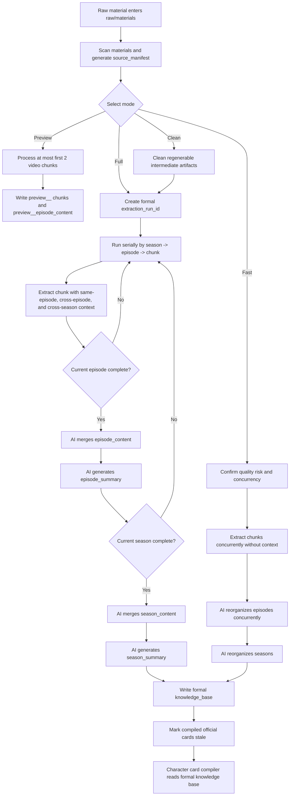
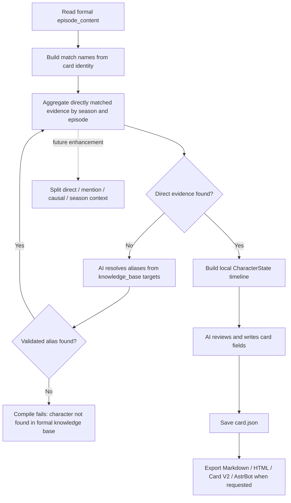

# Extraction Workflow Technical Overview (en_US)

Last reviewed: 2026-06-04.

This document is for users, researchers, and anyone who wants to understand the design of CharaPicker. It explains how long-form video material is extracted, compressed, organized, and eventually used to generate character cards.

The current stable implementation mainly covers video material, preview extraction, formal extraction, and the basic character card compilation path. Text, subtitles, transcription results, images, manga pages, and mixed media entering the unified preview/knowledge-base consumption path remain follow-up work.

## 1. Design Goals

CharaPicker follows the `Extract Once` principle: raw video, subtitle, or image material should be analyzed once, then preserved as reusable structured knowledge.

The workflow solves three problems:

- Long anime series or video collections are too large to send to a model in one pass.
- Character growth depends on chronology, so isolated clip summaries are not enough.
- Later character card generation should read structured results instead of re-analyzing the original video.

The system therefore organizes material into three levels: season, episode, and chunk.

- `chunk` is the extraction unit used to control model context length.
- `episode` is the smallest natural unit for plot understanding and character growth.
- `season` is the unit for stage-level growth, relationship changes, and long-running conflicts.

## 2. Input Material Convention

Current video material uses a simple and explainable directory recognition rule:

- The user selects a source root folder.
- Each first-level folder under the root represents one season.
- Video files inside a season folder represent episodes in that season.
- Season folders and episode files are sorted by name by default.

Recommended naming:

- Season folders: `01 To LOVEる`, `02 Motto To LOVEる`, `03 Darkness`
- Episode files: `01 xxx.mp4`, `02 xxx.mp4`, `10 xxx.mp4`
- Names like `xxx S01` and `xxx S02` can also work, as long as text sorting matches the real order.

Zero-padded numbering such as `01`, `02`, and `10` is recommended. This keeps simple text sorting reliable.

After import and processing, the system maintains consumable material under the project directory and generates `source_manifest.json`, which records the mapping from original folders and filenames to internal identifiers. Later steps use stable identifiers such as `season_001`, `episode_001`, and `chunk_0001`, instead of repeatedly inferring meaning from filenames.

The preview path currently collects at most the first 2 video chunks from `materials/`, writes `preview__` artifacts, and stays isolated from formal extraction. Preview results are not consumed by formal character card compilation.

## 3. Overall Flow

Recommended flow:

```text
raw material
-> detect seasons from folders
-> detect episodes by filename order
-> split each episode into chunks
-> extract structured results from each chunk
-> merge into episode-level full content
-> generate episode-level compressed summary
-> merge into season-level full content
-> generate season-level compressed summary
-> compile character state step by step by season and episode
-> generate final character card
```



Current formal extraction has three modes:

- `Full extraction`: high-quality linear extraction. It runs serially by season -> episode -> chunk. Each chunk includes structured historical context; each episode and season is reorganized by AI after completion.
- `Clean extraction`: cleans regenerable extraction artifacts first, then runs the same high-quality path as full extraction. It does not delete user material, exports, or character card master files. When a new formal run is written successfully, compiled official cards are marked stale.
- `Fast extraction`: chunk calls run concurrently with the user-confirmed concurrency value and no context. After all chunks finish, AI reorganizes episodes concurrently, then reorganizes seasons. This mode prioritizes speed and can introduce much larger deviations.

Formal extraction creates a new `extraction_run_id`. Full, clean, and fast modes only aggregate schema-valid full artifacts from the same run, so failed reruns do not mix old results into new output.

If a provider rejects a video segment, the project option “skip provider-rejected chunks” controls whether the flow continues. When skipping is allowed, missing sources are written into episode/season warnings. When skipping is not allowed, the formal flow fails with a clear reason.

One important design decision: character card generation does not start from chunks.

Chunks exist so the model can process long material. To simulate character growth, the compiler should start from full episode content and move episode by episode. Episodes match plot structure better than chunks and are a more natural unit for observing character change.

## 4. Extraction Context

Full and clean extraction organize context for the current chunk with this priority:

1. Current chunk content.
2. Full structured extraction results from completed chunks in the current episode.
3. Completed episode information in the current season: full AI-merged episode context when budget allows, then `context_long`, then `context_brief`.
4. Previous season summaries as low-priority background.

The current chunk is always the highest-priority evidence.

Completed chunks in the same episode can usually be included as full structured results instead of short summaries. Here, “full” means structured extraction results, not raw subtitle text or the full transcript. This preserves detail without repeatedly spending context on already processed source text.

The current implementation creates candidate views for historical episode context and selects them by information density, temporal proximity, relevance, and estimated token cost. It writes the decision into `context_policy`, including selected episodes, full-vs-summary choice, estimated token cost, and budget.

The current-season completed episode context pool is capped at 128k tokens, but the actual budget is also constrained by the model context window, current chunk/transcript, prompt, output reservation, and safety margin.

Model presets can store `context_window_tokens`. If no context window is available, the system uses a conservative fallback budget and records the policy accordingly.

## 5. Cross-Episode And Cross-Season Context

Within one season, later episodes include information from earlier completed episodes. The system does not trim by a fixed episode count. It considers information density, temporal proximity, relevance, and context cost. The previous episode is prioritized, strongly related older episodes are prioritized, and overlong content degrades from full episode context to long summary or brief summary.

Across seasons, previous season summaries can be included, but only as low-priority background. They explain character states, relationships, and unresolved conflicts before entering the current season. They must not override new facts found in current-season material.

The previous season summary should be labeled semantically as:

```text
PREVIOUS_SEASON_BACKGROUND
```

In other words, previous-season information is background, not current evidence.

Fast extraction does not include same-episode, cross-episode, or cross-season context during chunk extraction. It only reorganizes episodes and seasons after chunk extraction finishes, so it is useful for speed-first trials but should not replace the high-quality formal flow.

## 6. Knowledge Base Structure

Extraction results are written to the project `knowledge_base` and stored by season, episode, and chunk.

Each full, clean, or fast extraction run creates a new `extraction_run_id`. Chunk, episode, and season artifacts record that run id. Later aggregation only reads schema-valid artifacts from the current run.

Formal artifacts usually also record:

- `extraction_stage`: formal artifacts are `full`; preview artifacts use `preview` or `preview__` filename isolation.
- `schema_version`: used for compatibility and validation.
- `context_policy`: context selection, degradation, and budget information for the request.
- `token_usage`: prompt, completion, and total token usage returned by the model provider; fields may be empty when the provider does not return usage.
- `requested_output_tokens`: output token limit requested for text merge or summary calls.
- `aggregation_warnings`: skipped chunks, missing chunks, partial success, budget degradation, and similar warnings.

Recommended structure:

```text
knowledge_base/
├── source_manifest.json
├── seasons/
│   ├── season_001/
│   │   ├── season_content.json
│   │   ├── season_summary.json
│   │   ├── character_stage_states.json
│   │   └── episodes/
│   │       ├── episode_001/
│   │       │   ├── episode_content.json
│   │       │   ├── episode_summary.json
│   │       │   └── chunks/
│   │       │       ├── chunk_0001.json
│   │       │       └── chunk_0002.json
│   │       └── episode_002/
│   │           ├── episode_content.json
│   │           ├── episode_summary.json
│   │           └── chunks/
│   │               └── chunk_0001.json
│   └── season_002/
│       ├── season_content.json
│       ├── season_summary.json
│       ├── character_stage_states.json
│       └── episodes/
└── character_cards/
    └── {card_id}/
        └── card.json
```

This structure makes it possible to:

- Trace each character insight back to a season, episode, and chunk.
- Resume from completed chunks, episodes, or seasons after interruption.
- Read episode-level content in chronological order during character card generation.
- Show clear evidence sources in the UI later.

After a new formal knowledge-base run is written successfully, compiled official character cards are marked stale so the user knows to recompile. Draft cards, preview cards, and character card master files are not deleted by extraction cleanup.

## 7. Character Card Generation

Character card generation reads formal `episode_content.json`. It does not re-analyze original video material, consume preview artifacts, or read the legacy `ProjectConfig.target_characters` field.

Current character card compilation flow:

```text
read formal episode_content
-> build match names from character card identity fields
-> aggregate directly matched character evidence by season and episode
-> if direct matching fails, ask AI to resolve aliases from knowledge_base targets
-> build local CharacterState timeline
-> ask AI to review the state, timeline, and knowledge summary
-> save CharaPicker JSON master
-> optionally export Markdown, HTML, Character Card V2 JSON, or AstrBot copy checklist
```



Character matching uses these card identity fields:

- `character_name`
- `display_name`
- `aliases`
- `original_names`
- `romanized_names`

If the knowledge base uses candidate names such as `Lala` or `Haruna` while the card uses Chinese names or aliases, the system first tries local alias matching. If local matching finds nothing, a lightweight AI request resolves possible aliases from `episode_content.targets`. Returned aliases must appear in the knowledge-base candidates; the system does not accept invented names.

Character card compilation requires at least some direct evidence. If no direct evidence is found, compilation fails with `character was not found in the formal knowledge base`, avoiding fabricated cards for characters with no evidence.

The ideal long-term character growth path is still:

```text
previous season state or season-level background
-> current season episode 1 full content / direct evidence / mention evidence / causal context
-> update character state
-> current season episode 2 full content / direct evidence / mention evidence / causal context
-> update character state
-> ...
-> finish current season and generate stage summary
-> continue with next season
-> final polish
-> output character card
```

This better represents a character growth path. The character is not treated as a static profile; personality, relationships, conflicts, and changes are accumulated over time.

If information conflicts over time, the system should preserve it as dynamic change, such as disguise, misunderstanding, corruption, growth, or relationship shift, rather than simply overwriting old information.

Current baseline implementation: the AI review input for character cards now includes `direct_evidence_episodes`, `mention_evidence_episodes`, `causal_context_episodes`, and `season_context`. Direct evidence is formed by character-name or verified-alias matches in episode content fields; `targets` is only an alias candidate and supporting signal, not direct evidence by itself. Mention, causal, and season context can supplement motivation, relationship chains, and continuity, but must not override direct evidence.

## 8. Current Limitations

The current implementation still does not perform complex episode recognition or online matching against anime databases.

Users need to provide reasonably named folders and files. The system first uses simple sorting to determine season and episode order. Manual order adjustment can be added to the UI later.

This design intentionally stays transparent: users can understand why the system sorted material a certain way, and the implementation remains easier to resume and audit.

Current follow-up work:

- Continue validating and tuning character card context layering: direct evidence, mention evidence, causal context, and season-level background are connected in the baseline implementation, but real material still needs to verify the classification boundaries.
- Bring text, subtitles, transcription results, images, manga pages, and mixed media into the unified preview/knowledge-base consumption path.
- Add automated regression coverage. The formal extraction mainline is still mainly verified through static checks, manual runs, and log review.
- Reduce and redact model DEBUG logs so complete request/response bodies and temporary material URLs are not expanded.
- Provider-rejected video chunks can be skipped, but skipped content does not enter the knowledge base and must be reviewed through warnings.
