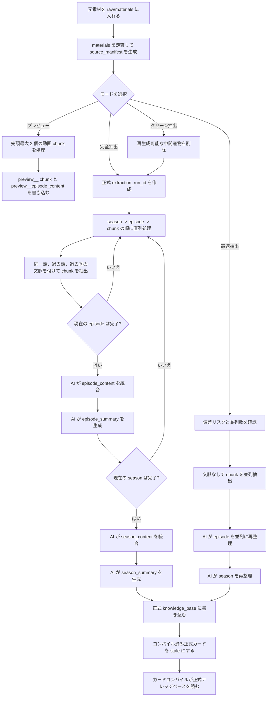
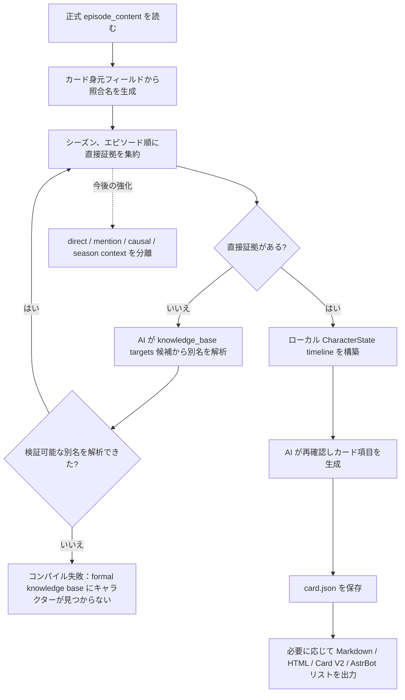

# 抽出ワークフロー技術説明（ja_JP）
最終確認日：2026-06-04。

この文書は、ユーザー、研究者、および CharaPicker の設計を理解したい人に向けて、長編動画素材がどのように抽出、圧縮、整理され、最終的にキャラクターカード生成に使われるかを説明します。

現在の安定実装は、主に動画素材の正式抽出、プレビュー抽出、キャラクターカードの基本コンパイル経路を対象にしています。テキスト、字幕、文字起こし結果、画像、漫画、混合メディアを統一されたプレビュー/ナレッジベース消費経路に入れる部分は、まだ今後の計画です。

## 1. 設計目標

CharaPicker の中心原則は `Extract Once` です。元の動画、字幕、画像素材は一度だけ解析し、その後は再利用できる構造化ナレッジベースとして保存します。

このワークフローは、次の三つの問題を解決します。

- 長編アニメや動画素材は長すぎるため、すべてを一度にモデルへ入れられない。
- キャラクターの成長には時間順序が必要であり、孤立した断片の要約だけでは足りない。
- 後続のキャラクターカード生成では、元動画を再解析するのではなく、構造化された結果を優先して読むべきである。

そのため、システムは素材を「シーズン、エピソード、chunk」の三層に分けます。

- `chunk` は抽出段階の処理単位で、モデルのコンテキスト長を制御するために使います。
- `エピソード` は、物語理解とキャラクター成長の最小の自然単位です。
- `シーズン` は、段階的な成長、関係変化、長期的な衝突をまとめる単位です。

## 2. 入力素材の約束

現在の動画素材は、単純で説明しやすいディレクトリ認識ルールを使います。

- ユーザーは素材のルートディレクトリを選びます。
- ルート直下の各フォルダを 1 シーズンとして扱います。
- 各シーズンフォルダ内の動画ファイルを、そのシーズンのエピソードとして扱います。
- シーズンフォルダとエピソードファイルは、既定で名前順に並べます。

推奨する命名方式：

- シーズンフォルダ：`01 To LOVEる`、`02 Motto To LOVEる`、`03 Darkness`
- エピソードファイル：`01 xxx.mp4`、`02 xxx.mp4`、`10 xxx.mp4`
- `xxx S01`、`xxx S02` のような名前も使えますが、名前順に並べた結果が実際の順序と一致する必要があります。

`01`、`02`、`10` のようなゼロ埋め番号を推奨します。これにより、単純なテキストソートでも正しい順序になります。

インポートと処理の後、システムはプロジェクトディレクトリ内に処理可能な素材を維持し、`source_manifest.json` を生成します。このファイルは元フォルダ名、元ファイル名、内部番号の対応を記録します。後続処理では `season_001`、`episode_001`、`chunk_0001` のような安定した ID を使い、元ファイル名から繰り返し推測しません。

プレビュー経路は現在、`materials/` から最大 2 個の動画 `chunk` だけを収集し、`preview__` 産物を書き込みます。プレビューは正式抽出産物を消費せず、その結果を正式キャラクターカード用ナレッジベースにも混ぜません。

## 3. 全体フロー

推奨フロー：

```text
元素材 -> フォルダでシーズンを識別 -> ファイル名順でエピソードを識別
-> 各エピソードを chunk に分割
-> 各 chunk の構造化結果を抽出
-> エピソード単位の完全内容へ統合
-> エピソード単位の圧縮要約を生成
-> シーズン単位の完全内容へ統合
-> シーズン単位の圧縮要約を生成
-> シーズン、エピソード順にキャラクター状態を段階的にコンパイル
-> 最終キャラクターカードを生成
```



現在の正式抽出入口には三つのモードがあります。

- `完全抽出`：高品質な線形フローを実行し、`season -> episode -> chunk` の順に直列で抽出します。各 `chunk` には構造化された過去文脈を付けます。各エピソード、各シーズンの終了後に、AI がエピソード単位とシーズン単位の産物を生成します。
- `クリーン抽出`：再生成可能な抽出中間産物を先に削除し、その後、完全抽出と同じ高品質な線形フローを実行します。削除対象にはユーザー素材、エクスポート結果、キャラクターカード原本は含まれません。新しい正式 run の書き込みに成功すると、コンパイル済みの正式キャラクターカードは再コンパイルが必要としてマークされます。
- `高速抽出`：`chunk` 段階では、ユーザーが確認した並列数で並行リクエストを送り、文脈は付けません。すべての `chunk` が完了した後、AI で `episode` を並列に再整理し、最後に `season` を再整理します。このモードは速度優先で、偏差は明らかに大きくなります。

正式抽出は新しい `extraction_run_id` を生成します。完全、クリーン、高速の各モードは、同じ run 内で schema が有効な full artifact だけを集約し、失敗後の再実行で古い結果が混ざることを防ぎます。

プロバイダーが特定の動画片段を拒否した場合に続行するかどうかは、プロジェクトの「拒否片段をスキップ」オプションで制御します。スキップを許可した場合、欠落元は episode/season の warnings に入ります。許可しない場合、対応する正式フローは失敗し、理由を表示します。

ここで重要なのは、キャラクターカード生成は `chunk` から始めないという設計です。

`chunk` は、長い素材をモデルで扱えるようにするための単位にすぎません。キャラクター成長を本当に再現する段階では、「各エピソードの完全内容」から始め、エピソード単位で進めます。エピソードは chunk より物語構造に合っており、キャラクター変化の観察単位としても自然です。

## 4. 抽出時のコンテキスト

完全抽出とクリーン抽出で現在の `chunk` を抽出するとき、システムは次の優先順位でコンテキストを組み立てます。

1. 現在の `chunk` 内容。
2. 現在のエピソードで完了済みの `chunk` の完全な構造化抽出結果。
3. 現在のシーズンで完了済みのエピソード情報。予算が許す場合は AI 統合後の完全なエピソード文脈を優先し、予算を超える場合は長い要約または短い要約へ降格します。
4. 前のシーズンのシーズン単位の長い要約。低優先度の背景として使います。

その中で、現在の `chunk` は常に最優先の証拠です。

同じエピソードは通常そこまで長くないため、そのエピソード内で既に抽出した `chunk` は「完全な構造化結果」として渡せます。ただし、ここでの「完全」とは構造化抽出結果であり、元字幕や原文全文ではありません。これにより細部を残しつつ、コンテキストの重複消費を避けられます。

現在の実装は、履歴 episode コンテキストの候補ビューを生成し、情報量、時間的近さ、関連性、推定コストに基づいて選択します。予算が許す場合は完全なエピソード単位コンテキストを送ります。予算を超える場合は `context_long` に降格し、それでも超える場合は `context_brief` に降格します。

コンテキスト選択は `context_policy` に書き込まれます。どの episode を選んだか、完全内容か要約か、推定 token コストと予算が記録されます。現在シーズンで完了済み episode の履歴コンテキストプール上限は 128k tokens ですが、実際に使える予算はモデルのコンテキストウィンドウ、現在の `chunk/transcript`、prompt、出力予約、安全余白にも制限されます。

モデル preset には `context_window_tokens` を記録できます。利用可能なウィンドウ情報がない場合、システムは保守的な既定予算を使い、コンテキスト戦略にその印を残します。

## 5. エピソード間とシーズン間

同じシーズン内では、後続エピソードに前の完了済みエピソード情報を付けます。システムは固定のエピソード数で切るのではなく、情報量、時間的近さ、関連性、コンテキストコストを合わせて判断します。直前のエピソードを優先し、強く関連する古いエピソードも優先します。内容が長すぎる場合は、完全なエピソード文脈から長い要約または短い要約へ降格します。

シーズンをまたぐ場合は、前シーズンのシーズン単位の長い要約を渡せますが、これは低優先度の背景です。キャラクターが現在シーズンに入る前の状態、関係、未解決の衝突を説明するためのものであり、現在シーズン素材の新しい事実を上書きしてはいけません。

意味上、前シーズン要約には次のラベルを付けることを推奨します。

```text
PREVIOUS_SEASON_BACKGROUND
```

つまり、前シーズン情報は背景であり、現在の証拠ではありません。

高速抽出の `chunk` 段階では、同一エピソード、過去エピソード、過去シーズンのコンテキストを付けません。`chunk` 完了後に AI でエピソードとシーズンを再整理するだけなので、速度優先の試行には向いていますが、高品質な正式フローの代替には向きません。

## 6. ナレッジベース構造

抽出結果はプロジェクトの `knowledge_base` に書き込まれ、シーズン、エピソード、`chunk` の階層で保存されます。

完全、クリーン、高速の各抽出は、毎回新しい `extraction_run_id` を生成します。`chunk`、`episode`、`season` 産物にはその run id を記録し、後続の統合では現在 run 内で schema が有効な産物だけを読みます。これにより、失敗後の再実行で古い結果が混ざることを避けます。

正式産物には通常、次の情報も記録します。

- `extraction_stage`：正式産物は `full`、プレビュー産物は `preview`、または `preview__` ファイル名プレフィックスで隔離します。
- `schema_version`：後続の互換性と検証に使います。
- `context_policy`：今回のリクエストで採用したコンテキスト選択、降格、予算情報。
- `token_usage`：モデルが返した入力、出力、合計 token の統計。プロバイダーが返さない場合、関連フィールドは空になることがあります。
- `requested_output_tokens`：今回のテキスト統合または要約リクエストに使った出力 token 上限。
- `aggregation_warnings`：スキップ片段、欠落 `chunk`、部分成功、予算降格などの警告。

推奨構造：

```text
knowledge_base/
|-- source_manifest.json
|-- seasons/
|   |-- season_001/
|   |   |-- season_content.json
|   |   |-- season_summary.json
|   |   |-- character_stage_states.json
|   |   `-- episodes/
|   |       |-- episode_001/
|   |       |   |-- episode_content.json
|   |       |   |-- episode_summary.json
|   |       |   `-- chunks/
|   |       |       |-- chunk_0001.json
|   |       |       `-- chunk_0002.json
|   |       `-- episode_002/
|   |           |-- episode_content.json
|   |           |-- episode_summary.json
|   |           `-- chunks/
|   |               `-- chunk_0001.json
|   `-- season_002/
|       |-- season_content.json
|       |-- season_summary.json
|       |-- character_stage_states.json
|       `-- episodes/
`-- character_cards/
    `-- {card_id}/
        `-- card.json
```

この構造の利点：

- 各キャラクター情報がどのシーズン、どのエピソード、どの `chunk` に由来するかを追跡できます。
- 中断後、完了済みの `chunk`、エピソード、シーズンから再開できます。
- キャラクターカード生成時に、エピソード単位の内容を時系列で読めます。
- 後続 UI で、キャラクター成長の根拠を明確に表示できます。

正式ナレッジベースに新しい run 産物を書き込むと、コンパイル済みの正式キャラクターカードは `stale` としてマークされ、ユーザーに再コンパイルを促します。下書きカード、プレビューカード、キャラクターカード原本そのものは、抽出クリーンアップでは削除されません。

## 7. キャラクターカード生成

キャラクターカード生成は、正式ナレッジベースの `episode_content.json` を読みます。元動画素材を再解析せず、プレビュー産物や古い `ProjectConfig.target_characters` も読みません。

現在のキャラクターカードコンパイルフロー：

```text
正式 episode_content を読む
-> キャラクターカードの身元フィールドから照合名を生成
-> シーズン、エピソード順に直接ヒットしたキャラクター証拠を集約
-> 直接照合に失敗した場合、AI で knowledge_base targets 候補から別名を解析
-> ローカル CharacterState timeline を構築
-> キャラクター状態、timeline、ナレッジベース要約を AI に渡して再確認し、カード項目を生成
-> CharaPicker JSON 原本を保存
-> 必要に応じて Markdown、HTML、Character Card V2 JSON、AstrBot 手動コピーリストを出力
```



キャラクター照合には、キャラクターカードの身元フィールドを使います。

- `character_name`
- `display_name`
- `aliases`
- `original_names`
- `romanized_names`

ナレッジベース側で `Lala`、`Haruna` などの候補名を使い、キャラクターカード側で中国語名や別名を使っている場合、システムはまずローカル別名で照合します。ローカルで完全に見つからない場合だけ、軽量 AI リクエストで `episode_content.targets` の候補リストから可能な別名を解析します。AI が返す別名は、実際にナレッジベース候補内に存在している必要があり、空想で生成してはいけません。

キャラクターカードコンパイルには、少なくとも直接証拠が必要です。直接証拠が一つもない場合、コンパイルは失敗し、`character was not found in the formal knowledge base` と表示します。これにより、登場していない、または証拠がないキャラクターを無理に生成することを避けます。

理想的な長期キャラクター成長経路は、引き続き次の形です。

```text
前シーズンのキャラクター状態またはシーズン背景
-> 現在シーズン第 1 話の完全内容 / 直接証拠 / 言及証拠 / 因果コンテキスト
-> キャラクター状態を更新
-> 現在シーズン第 2 話の完全内容 / 直接証拠 / 言及証拠 / 因果コンテキスト
-> キャラクター状態を更新
-> ...
-> 現在シーズン終了、段階要約を生成
-> 次シーズンへ継続
-> 最終整理
-> キャラクターカードを出力
```

この方式は、キャラクターの成長経路を記述するのにより適しています。キャラクターを静的な設定として扱わず、性格、関係、衝突、変化を時間に沿って積み上げます。

前後の情報に矛盾がある場合、システムはそれを単純に上書きせず、偽装、誤解、闇落ち、成長、関係の転換など、キャラクターの動的変化として記録するべきです。

現在の基礎実装：キャラクターカードの AI 再確認入力は、`direct_evidence_episodes`、`mention_evidence_episodes`、`causal_context_episodes`、`season_context` を含むようになりました。direct 証拠は episode の内容フィールドでキャラクター名または検証済み別名に命中した場合に形成されます。`targets` は別名候補と補助情報であり、それだけでは direct 証拠になりません。mention、causal、season_context は動機、関係のつながり、連続性を補足できますが、direct 証拠を上書きしてはいけません。

## 8. 現在の制限

現在はまだ、複雑なエピソード識別や外部アニメデータベースとのオンライン照合は行いません。

ユーザーは、ある程度整理されたフォルダ名とファイル名を用意する必要があります。システムはまず単純なソートでシーズンとエピソードの順序を決め、後から UI で手動順序調整を追加できます。

この設計は意図的に透明性を保っています。ユーザーはシステムがなぜその順序にしたかを理解しやすく、実装面でも再開と追跡がしやすくなります。

今後さらに整備が必要な点：

- キャラクターカードコンパイルのコンテキスト分層は引き続き検証と調整が必要です。直接証拠、言及証拠、因果コンテキスト、シーズン背景は基礎実装に接続済みですが、実素材で分類境界を確認する必要があります。
- テキスト、字幕、文字起こし結果、画像、漫画、混合メディアは、まだ統一プレビュー/ナレッジベース消費経路へ完全には入っていません。
- 自動回帰はまだ不足しており、正式抽出主線は現在、主に静的チェック、手動試行、ログ確認に依存しています。
- モデル DEBUG ログは、完全なリクエスト/レスポンス本文や一時素材 URL が展開されないよう、引き続き脱感作とノイズ削減が必要です。
- プロバイダーが動画片段を拒否した場合はスキップして続行できますが、スキップされた片段の情報はナレッジベースに入りません。ユーザーは欠落 warnings を確認する必要があります。
