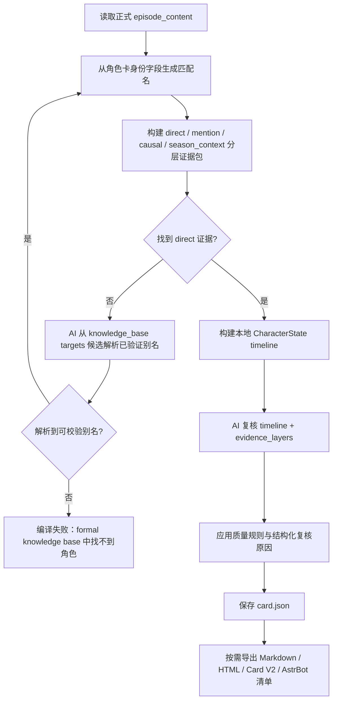

# 提取工作流技术说明（zh_CN）

最近核对日期：2026-06-21。

本文面向用户、研究者和想理解 CharaPicker 设计的人，说明长篇视频素材如何被提取、压缩、组织，并最终用于生成角色卡。

当前实现以 `FormalExtractionRunPlan` 作为正式提取主索引，顶层媒体类型固定为 `video`、`image`、`audio`、`text`。视频、普通文本、`.srt` / `.ass`、PNG/JPEG/WEBP 静态图片、漫画/图集页组，以及由 audio/video 派生的 transcript 已有预览或正式提取路径；预览已支持通用 unit 成本采样，正式提取已通过内部分发表选择 video/text/image/audio transcript/native media handler。原生音频/视频理解已作为补充正式 handler 接入，用于保存听觉摘要、画面摘要、语气、环境声、音乐和画外声音等视听线索；它不替代 transcript，也不冒充字幕或转写结果。跨媒体证据消费仍会在后续角色卡与质量阶段继续加强。

## 1. 设计目标

CharaPicker 的核心原则是 `Extract Once`：原始视频、音频、图片、字幕或文本素材只解析一次，之后沉淀为可复用的结构化知识库。

这套流程要解决三个问题：

- 长篇番剧或视频素材太长，不能一次性全部塞进模型。
- 角色成长需要时间顺序，不能只做孤立片段总结。
- 后续生成角色卡时，应优先读取结构化结果，而不是重复分析原视频。

因此，系统把素材拆成“季、集、chunk”三层：

- `chunk` 是提取阶段的处理单位，用来控制模型上下文长度。
- `集` 是剧情理解和角色成长的最小自然单位。
- `季` 是阶段性成长、关系变化和长期冲突的总结单位。

代码层顶层媒体类型只允许 `video`、`image`、`audio`、`text`。番剧、漫画、广播剧、小说、字幕、设定集等属于内容形态或 metadata；`transcript` 不是第五种媒体类型，而是从 `video` 或 `audio` 派生出的 `text` 型中间产物/成果。

## 2. 输入素材约定

当前视频素材采用简单、可解释的目录识别规则：

- 用户选择一个素材根目录。
- 根目录下每个一级文件夹表示一季。
- 每季文件夹中的视频文件表示该季的集。
- 季文件夹和集文件默认按名称排序。

推荐命名方式：

- 季文件夹：`01 To LOVEる`、`02 Motto To LOVEる`、`03 Darkness`
- 集文件：`01 xxx.mp4`、`02 xxx.mp4`、`10 xxx.mp4`
- 也可以使用 `xxx S01`、`xxx S02`，但需要保证名称排序后符合实际顺序。

建议使用补零编号，例如 `01`、`02`、`10`。这样简单文本排序就能得到正确顺序。

导入和处理后，系统会在项目目录下维护可处理素材。正式提取开始时，系统会扫描 `materials/` 并生成 `FormalExtractionRunPlan`，写入 `knowledge_base/extraction_runs/{run_id}/plan.json`。run plan 记录 `MaterialRef`、`ExtractionUnit`、媒体类型、内容形态、派生成果和内部编号的映射；后续流程使用稳定编号，例如 `season_001`、`episode_001`、`chunk_0001`，不会反复依赖原始文件名推断。`source_manifest.json` 只作为旧观察索引或调试产物，不再作为正式提取输入契约。

预览链路从同一份 run plan 构建通用候选，并按成本稳定选择：字幕/现成 transcript、普通文本、静态图片、需要先转写的音频、视频。预览最多生成 2 个 chunk，每个候选首轮只取 1 个；若某个候选失败或没有结果，会继续尝试后续素材，但总尝试数限制为 4，防止失败素材放大预览成本。不支持的 VTT/LRC、BMP/GIF 或模型能力不匹配会以带 `media_type`、`content_form`、`unit_id` 和来源路径的 warning 进入洞察流，不阻断其它候选。

预览 chunk 和 episode 内容继续使用 `preview__` 前缀隔离，不读取或覆盖正式 chunk、正式 episode 内容和正式角色卡知识。音频预览可以生成可复用的 `episode_transcript.json` 派生中间体，但不会把预览用 run plan 持久化到 `extraction_runs/`。

正式提取入口会先从 run plan 构建 handler 分发表，再调用被选中的 handler。首批分发覆盖视频、普通文本、字幕/台本、已物化 transcript、静态图片、需要先转写的音频素材，以及补充型原生音频/视频理解。`.srt` / `.ass` 会按同名视频或 episode 目录挂到视频 episode；对齐失败时会作为独立 text episode 继续处理，并在 run plan warning 中说明原因。模型不支持图片、原生视听能力不足、格式暂不支持或暂无正式 handler 的 unit 会以 warning 进入洞察流，并携带 `media_type`、`content_form`、`unit_id` 和来源路径；这些 warning 不会阻断其它可提取 unit。视频仍保留原有视频 chunk 提取路径，避免在混合媒体改造中改变既有视频行为。

原生音频/视频理解只在 provider 声明 `audio_understanding`、`native_video` 或 `video_audio_understanding` 且当前中间件通道可承载该输入时运行。其输出 chunk 会写入 `native_media_insight=true`、`transcript_policy=supplement_only` 和 `does_not_replace_transcript=true`，`source_trace.derived_artifact_refs` 不引用 transcript 派生成果。换句话说，ASR/STT transcript 仍负责可追溯对白文本；原生视听理解只补充音色、语气、环境声、音乐、画外声音和原生视频输入能看到/听到的线索。

漫画/图集页组当前按文件夹建立独立 image episode：同一文件夹内的 PNG/JPEG/WEBP/BMP/GIF 会按自然页码排序生成 page unit，metadata 记录 `chapter_id`、`chapter_path`、`page_order`、总页数和可支持页数。BMP/GIF 仍保留在 run plan 中作为 unsupported warning；不同文件夹不会被自动合并为同一章节或剧情 episode。

## 3. 总体流程

推荐流程如下：

```text
原素材
-> 按文件夹识别季
-> 按文件名排序识别集
-> 单集切分为 chunk
-> 提取每个 chunk 的结构化结果
-> 合并为集级完整内容
-> 生成集级压缩摘要
-> 合并为季级完整内容
-> 生成季级压缩摘要
-> 按季、按集逐步编译角色状态
-> 生成最终角色卡
```

```mermaid
flowchart TD
    A[原素材进入 raw/materials] --> B[扫描 materials 并建立素材单元视图]
    B -.-> M[source_manifest.json 调试/旧观察索引]
    B --> C{选择模式}
    C -->|预览| P[按成本选择最多 2 个通用 unit]
    P --> PS[字幕/transcript -> 文本 -> 图片 -> 音频转写 -> 视频]
    PS --> PF{候选成功?}
    PF -->|否| P
    PF -->|是| P1[写入 preview__ chunk 与 preview__episode_content]
    C -->|完整提取| F[创建 extraction_run_id 与 FormalExtractionRunPlan]
    C -->|洁净提取| CL[清理可再生中间产物]
    CL --> F
    F --> RP[写入 extraction_runs/{run_id}/plan.json]
    RP --> L[按 season -> episode -> chunk 串行推进]
    L --> CH[chunk 带同集、跨集、跨季上下文提取]
    CH --> EC{当前 episode 完成?}
    EC -->|否| L
    EC -->|是| EM[AI 合并 episode_content]
    EM --> ES[AI 生成 episode_summary]
    ES --> SC{当前 season 完成?}
    SC -->|否| L
    SC -->|是| SM[AI 合并 season_content]
    SM --> SS[AI 生成 season_summary]
    C -->|快速提取| Q[确认偏差风险与并发数]
    Q --> FQ[创建 extraction_run_id 与 FormalExtractionRunPlan]
    FQ --> RQ[写入 extraction_runs/{run_id}/plan.json]
    RQ --> QC[chunk 并发提取且不带上下文]
    QC --> QE[AI 并发重整理 episode]
    QE --> QS[AI 重整理 season]
    SS --> KB[写入正式 knowledge_base]
    QS --> KB
    KB --> ST[标记已编译正式角色卡 stale]
    ST --> CC[角色卡编译读取正式知识库]
```

当前正式提取入口有三种模式：

- `完整提取`：执行高质量线性流程，按 season -> episode -> chunk 顺序串行提取。每个 chunk 会带入结构化历史上下文；每集、每季结束后用 AI 生成集级和季级产物。
- `洁净提取`：先清理可重新生成的提取中间产物，再执行与完整提取相同的高质量线性流程。清理不会删除用户素材、导出结果或角色卡母本；成功写入新正式 run 后，已编译的正式角色卡会标记为需要重编译。
- `快速提取`：视频 chunk 阶段按用户确认的并发数并行请求，不带上下文；全部视频 chunk 完成后，再用 AI 并发重整理 episode，最后重整理 season。当前文本、图片、audio transcript 和原生视听 handler 仍按正式串行路径处理，并在运行时发出 warning 说明回退。这个模式速度优先，偏差会明显更大。

正式提取会生成新的 `extraction_run_id` 和 `FormalExtractionRunPlan`。完整、洁净和快速模式只聚合同一 run 中 schema 合格的 full artifact，避免失败重跑时混入旧结果。

如果供应商拒绝某个视频片段，是否继续由项目里的“跳过拒绝片段”选项控制。允许跳过时，缺失来源会进入 episode/season 的 warnings；不允许跳过时，对应正式流程会失败并提示原因。

这里有一个重要设计：角色卡生成不从 chunk 开始。

chunk 只是为了让模型能处理长素材。真正模拟角色成长时，应从“每集完整内容”开始，按集推进。单集比 chunk 更符合剧情结构，也更适合作为角色变化的观察单位。

## 4. 提取时的上下文

完整提取和洁净提取在提取当前 chunk 时，系统按以下优先级组织上下文：

1. 当前 chunk 内容。
2. 当前集已完成 chunk 的完整结构化提取结果。
3. 当前季已完成集的信息：预算允许时优先传 AI 合并后的完整集级上下文，超预算时降级为长摘要或短摘要。
4. 前面季的季级长摘要，用作低优先级背景。

其中，当前 chunk 永远是最高优先级证据。

同一集通常不会太长，所以当前集内已经提取过的 chunk 可以带“完整结构化结果”，而不是只带短摘要。但这里的“完整”指结构化提取结果，不是原始字幕或原文全文。这样可以保留细节，同时避免重复消耗上下文。

当前实现会为历史 episode 上下文生成候选视图，并按信息量、时间接近度、相关性和估算成本选择。预算允许时发送完整集级上下文；超预算时降级为 `context_long`；仍超预算时降级为 `context_brief`。

上下文选择会写入 `context_policy`，记录选中了哪些 episode、使用了完整内容还是摘要、估算 token 成本和预算。当前季已完成 episode 的历史上下文池上限为 128k tokens，但实际可用预算还会受模型上下文窗口、当前 chunk/transcript、prompt、输出预留和安全余量共同限制。

模型 preset 中可以记录 `context_window_tokens`。如果没有可用窗口信息，系统会使用保守默认预算，并在上下文策略中保留相应标记。

## 5. 跨集与跨季

同一季内，后续集会带上前面已完成集的信息。系统不按固定集数裁剪，而是综合信息量、时间接近度、相关性和上下文成本：上一集优先，强相关旧集优先，过长内容会从完整集级上下文降级为长摘要或短摘要。

跨季时，可以带上前面季的季级长摘要，但它只作为低优先级背景。它负责说明角色进入当前季前的状态、关系和未解决冲突，不能覆盖当前季素材中的新事实。

建议语义上把前一季摘要标记为：

```text
PREVIOUS_SEASON_BACKGROUND
```

也就是说，前一季信息是背景，不是当前证据。

快速提取的视频 chunk 阶段不带同集、跨集或跨季上下文。它只在视频 chunk 完成后再用 AI 重整理集和季，因此适合速度优先的试跑，不适合替代高质量正式流程。文本、图片、audio transcript 和原生视听线索暂不走快速并发聚合，而是复用正式串行 handler 和 `source_trace` 聚合规则，以避免在混合媒体阶段提前改变语义。

## 6. 知识库结构

提取结果会写入项目的 `knowledge_base`，并按季、集、chunk 分层保存。

每次完整、洁净或快速提取都会生成新的 `extraction_run_id` 和 run plan。run plan 是正式提取的主索引，保存为 `knowledge_base/extraction_runs/{run_id}/plan.json`；chunk、episode 和 season 产物会记录该 run id，后续合并只读取当前 run 中 schema 合格的产物，避免失败重跑时混入旧结果。

正式产物通常还会记录：

- `extraction_stage`：正式产物为 `full`，预览产物为 `preview` 或使用 `preview__` 文件名前缀隔离。
- `schema_version`：用于后续兼容和校验。
- `context_policy`：本次请求采用的上下文选择、降级和预算信息。
- `token_usage`：模型返回的输入、输出和总 token 统计；如果供应商没有返回，相关字段可能为空。
- `requested_output_tokens`：本次文本合并或摘要请求使用的输出 token 上限。
- `aggregation_warnings`：跳过片段、缺失 chunk、部分成功或预算降级等提示。
- `source_trace` / `media_types`：记录产物来自哪些素材单元和媒体类型，避免把视频、音频、图片、文本或其派生成果混为同一种来源。`source_kind` 只是旧兼容摘要字段，聚合产物会从 `source_trace.media_types` 推导单一来源或 `mixed`。
- `derived_artifacts`：记录 transcript 等由原始素材派生出的中间产物。transcript 以 `text` 型成果进入知识库，不作为新的顶层媒体类型。

推荐结构：

```text
knowledge_base/
├── extraction_runs/
│   └── {run_id}/
│       └── plan.json
├── source_manifest.json              # 旧观察索引/调试产物
├── seasons/
│   ├── season_001/
│   │   ├── season_content.json
│   │   ├── season_summary.json
│   │   ├── character_stage_states.json
│   │   └── episodes/
│   │       ├── episode_001/
│   │       │   ├── episode_content.json
│   │       │   ├── episode_summary.json
│   │       │   ├── episode_transcript.json
│   │       │   └── chunks/
│   │       │       ├── chunk_0001.json
│   │       │       └── chunk_0002.json
│   │       └── episode_002/
│   │           ├── episode_content.json
│   │           ├── episode_summary.json
│   │           └── chunks/
│   │               └── chunk_0001.json
│   └── season_002/
│       ├── season_content.json
│       ├── season_summary.json
│       ├── character_stage_states.json
│       └── episodes/
└── character_cards/
    └── {card_id}/
        └── card.json
```

这种结构的好处是：

- 可以定位每条角色信息来自哪一季、哪一集、哪一个 chunk。
- 中断后可以从已完成的 chunk、集或季继续。
- 角色卡生成时可以按时间顺序读取集级内容。
- 后续 UI 可以清楚展示角色成长来源。

正式知识库成功写入新 run 产物后，已编译的正式角色卡会标记为 stale，提示用户重新编译。草稿卡、预览卡和角色卡母本本身不会在提取清理中被删除。

## 7. 失败样例记录与打包

当文本、图片、audio transcript、原生视听或视频 chunk 的模型调用、JSON 解析或转写失败时，系统会在本地记录一份结构化失败样例：

```text
projects/{project_id}/cache/refusal_samples/{sample_id}/refusal_sample.json
```

样例用于后续分析 prompt 边界、模型能力、输出截断或素材处理问题。它记录 `media_type`、`content_form`、unit、项目内来源路径、模型供应商、backend、模型名、prompt purpose、提取阶段、run/season/episode/chunk 标识、错误类型和脱敏错误摘要。它不会保存 API Key、完整 prompt、完整模型响应或原始隐私文本。

用户明确打包时，样例会导出到：

```text
projects/{project_id}/output/refusal_samples/{project_name}_{created_at}_{sample_hash}.zip
```

zip 至少包含 `refusal_sample.json` 和 `package_manifest.json`。如果用户选择包含素材，系统只会复制样例引用到的项目内素材；大型素材会按索引引用，缺失素材和项目外路径会写入 warning，不会被静默复制。应用不会自动上传失败样例或素材。

能力不支持、格式暂不支持或 handler 不可用这类情况仍作为 warning 进入洞察流，不冒充模型拒绝样例；它们说明当前链路不可处理，不代表模型已经拒绝了某个 prompt。

## 8. 角色卡生成

角色卡生成从正式知识库读取 `episode_content.json`，不会重新分析原始视频素材，也不会读取预览产物或旧的 `ProjectConfig.target_characters`。

当前角色卡编译流程：

```text
读取正式 episode_content
-> 根据角色卡身份字段生成匹配名
-> 构建 direct / mention / causal / season_context 分层证据包
-> 若没有 direct 证据，尝试用 AI 从知识库 targets 候选中解析已验证别名
-> 用已验证别名重建分层证据包
-> 没有 direct 证据则失败
-> 构建本地角色状态 timeline
-> 把角色状态、timeline、知识库摘要和 evidence_layers 交给 AI 复核并生成角色卡字段
-> 写入 alias_resolution、needs_review_reasons、conflict_groups、evidence_source_profile 和 parse_diagnostics
-> 保存 CharaPicker JSON 母本
-> 可选导出 Markdown、HTML、Character Card V2 JSON 或 AstrBot 手动复制清单
```



角色匹配使用角色卡身份字段：

- `character_name`
- `display_name`
- `aliases`
- `original_names`
- `romanized_names`

如果知识库里使用 `Lala`、`Haruna` 等候选名，而角色卡使用中文名或别名，系统会先用本地别名匹配；本地完全找不到时，再用轻量 AI 请求从 `episode_content.targets` 的候选列表里解析可能的别名。AI 返回的别名必须实际出现在知识库候选中，不能凭空生成。

角色卡编译需要至少找到直接证据。没有任何直接证据时，角色卡编译会失败并提示 `character was not found in the formal knowledge base`，避免把没有出现或没有证据的角色硬编出来。

在混合媒体项目中，角色卡证据不能只保留“命中了哪一集”。每条 direct、mention、causal 或 season_context 证据 entry 都会带一份紧凑 `source_metadata`，用于描述该证据来自什么素材和什么中间成果：

- `source_kind`：旧兼容摘要字段，混合来源会记录为 `mixed`。
- `media_types`：正式顶层媒体类型，只允许 `video`、`image`、`audio`、`text`。
- `content_forms`：内容形态或语义标签，例如 `anime`、`script`、`subtitle`、`manga`。
- `source_counts`：聚合时统计到的素材、unit、chunk 或派生成果数量。
- `source_trace`：压缩后的素材引用、unit 引用、派生成果引用和证据定位信息。
- `evidence_refs`：从 episode 内容继承的可读证据引用。

角色卡质量评估会额外写入 `quality_checks.evidence_source_profile`，汇总本次编译实际使用了哪些媒体类型、内容形态和来源摘要，以及多少证据带有 `source_trace` 或 `evidence_refs`。这些字段服务于证据可信度、跨媒体覆盖和后续 UI 展示，不代表系统会重新打开原素材；角色卡编译仍只消费正式知识库产物。

理想的长期角色成长路线仍然是：

```text
前一季角色状态或季级背景
-> 当前季第 1 集完整内容 / 直接证据 / 提及证据 / 因果上下文
-> 更新角色状态
-> 当前季第 2 集完整内容 / 直接证据 / 提及证据 / 因果上下文
-> 更新角色状态
-> ...
-> 当前季结束，生成阶段总结
-> 下一季继续
-> 最终整理
-> 输出角色卡
```

这种方式更适合描述角色成长路线。它不会把角色看成一个静态设定，而是把性格、关系、冲突和变化按时间逐步累积。

如果前后信息出现矛盾，系统应记录为角色的动态变化，例如伪装、误解、黑化、成长或关系转折，而不是简单覆盖旧信息。

当前基础实现：角色卡 AI 复核输入已经接入 `direct_evidence_episodes`、`mention_evidence_episodes`、`causal_context_episodes` 和 `season_context`。direct 证据由 episode 内容字段中的角色名或已验证别名命中形成；`targets` 只作为别名候选和辅助信息，不单独算 direct。mention、causal 和 season_context 用于补充动机、关系链和连续性，不能覆盖 direct 证据。分层证据和质量评估写入 `card.extensions["charapicker"]`，其中包含 `compile_evidence_layers`、每条证据的 `source_metadata`、`alias_resolution`、`needs_review_reasons`、`conflict_groups`、`evidence_source_profile` 和 `parse_diagnostics`；普通 `quality.warnings` 只保留用户可读 warning，不直接暴露内部 reason key。

## 9. 当前限制

当前仍不做复杂剧集识别，也不联网匹配番剧数据库。

用户需要提供相对合理的文件夹和文件命名。系统先用简单排序得到季和集的顺序，之后可以在 UI 中增加手动调整顺序。

这个设计故意保持透明：用户能理解系统为什么这样排序，开发上也更容易保证可恢复、可追溯。

当前仍需后续完善：

- 角色卡编译上下文分层已接入基础实现，但仍需继续用真实素材验收和调优 direct、mention、causal 与 season_context 的分类边界。
- 普通文本、字幕、音频 transcript、静态图片和原生视听补充线索已进入基础预览/正式知识库路径；角色卡证据层已能保留跨媒体来源 metadata，但漫画页组语义、混合媒体统一调度、证据可信度权重和 UI 展示仍需继续完善。
- 自动化回归仍不足，正式提取主线目前主要依赖静态检查、手动试跑和日志复核。
- 模型 DEBUG 日志需要继续脱敏和降噪，避免完整请求/响应正文或临时素材 URL 展开。
- 供应商拒绝视频片段时可以跳过并继续，但被跳过片段的信息不会进入知识库，需要用户复核缺失 warnings。
