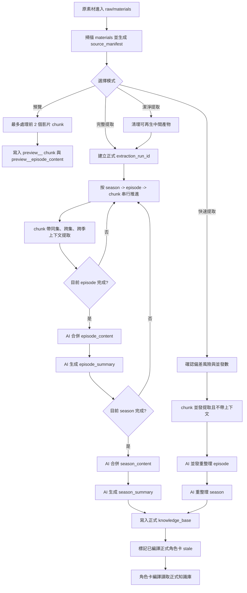
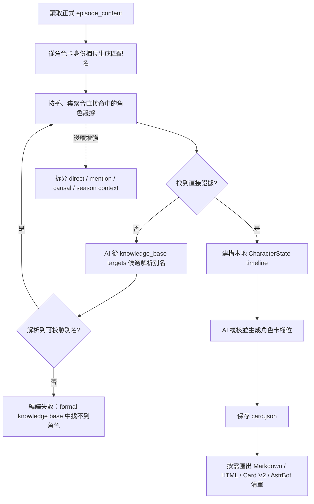

# 提取工作流程技術說明（zh_TW）
最近核對日期：2026-06-04。

本文面向使用者、研究者和想理解 CharaPicker 設計的人，說明長篇影片素材如何被提取、壓縮、組織，並最終用於生成角色卡。

目前穩定實作主要覆蓋影片素材的正式提取、預覽提取和角色卡基礎編譯鏈路。文字、字幕、轉寫結果、圖片、漫畫和混合媒體進入統一預覽/知識庫消費路徑仍屬於後續計畫。

## 1. 設計目標

CharaPicker 的核心原則是 `Extract Once`：原始影片、字幕或圖像素材只解析一次，之後沉澱為可複用的結構化知識庫。

這套流程要解決三個問題：

- 長篇番劇或影片素材太長，不能一次性全部塞進模型。
- 角色成長需要時間順序，不能只做孤立片段總結。
- 後續生成角色卡時，應優先讀取結構化結果，而不是重複分析原始影片。

因此，系統把素材拆成「季、集、chunk」三層：

- `chunk` 是提取階段的處理單位，用來控制模型上下文長度。
- `集` 是劇情理解和角色成長的最小自然單位。
- `季` 是階段性成長、關係變化和長期衝突的總結單位。

## 2. 輸入素材約定

目前影片素材採用簡單、可解釋的目錄識別規則：

- 使用者選擇一個素材根目錄。
- 根目錄下每個一級資料夾表示一季。
- 每季資料夾中的影片檔案表示該季的集。
- 季資料夾和集檔案預設按名稱排序。

推薦命名方式：

- 季資料夾：`01 To LOVEる`、`02 Motto To LOVEる`、`03 Darkness`
- 集檔案：`01 xxx.mp4`、`02 xxx.mp4`、`10 xxx.mp4`
- 也可以使用 `xxx S01`、`xxx S02`，但需要保證名稱排序後符合實際順序。

建議使用補零編號，例如 `01`、`02`、`10`。這樣簡單文字排序就能得到正確順序。

匯入和處理後，系統會在專案目錄下維護可處理素材，並生成 `source_manifest.json`，記錄原始資料夾、原始檔名和內部編號的映射。後續流程使用穩定編號，例如 `season_001`、`episode_001`、`chunk_0001`，不會反覆依賴原始檔名推斷。

預覽鏈路目前只從 `materials/` 中最多收集前 2 個影片 `chunk`，寫入 `preview__` 產物。預覽不會消費正式提取產物，也不會把結果混入正式角色卡知識庫。

## 3. 總體流程

推薦流程如下：

```text
原素材 -> 按資料夾識別季 -> 按檔名排序識別集
-> 單集切分為 chunk
-> 提取每個 chunk 的結構化結果
-> 合併為集級完整內容
-> 生成集級壓縮摘要
-> 合併為季級完整內容
-> 生成季級壓縮摘要
-> 按季、按集逐步編譯角色狀態
-> 生成最終角色卡
```



目前正式提取入口有三種模式：

- `完整提取`：執行高品質線性流程，按 `season -> episode -> chunk` 順序串行提取。每個 `chunk` 會帶入結構化歷史上下文；每集、每季結束後由 AI 生成集級和季級產物。
- `潔淨提取`：先清理可重新生成的提取中間產物，再執行與完整提取相同的高品質線性流程。清理不會刪除使用者素材、匯出結果或角色卡母本；成功寫入新正式 run 後，已編譯的正式角色卡會標記為需要重編譯。
- `快速提取`：`chunk` 階段按使用者確認的並發數並行請求，不帶上下文；全部 `chunk` 完成後，再用 AI 並發重整理 `episode`，最後重整理 `season`。這個模式速度優先，偏差會明顯更大。

正式提取會生成新的 `extraction_run_id`。完整、潔淨和快速模式只聚合同一 run 中 schema 合格的 full artifact，避免失敗重跑時混入舊結果。

如果供應商拒絕某個影片片段，是否繼續由專案裡的「跳過拒絕片段」選項控制。允許跳過時，缺失來源會進入 episode/season 的 warnings；不允許跳過時，對應正式流程會失敗並提示原因。

這裡有一個重要設計：角色卡生成不從 `chunk` 開始。

`chunk` 只是為了讓模型能處理長素材。真正模擬角色成長時，應從「每集完整內容」開始，按集推進。單集比 chunk 更符合劇情結構，也更適合作為角色變化的觀察單位。

## 4. 提取時的上下文

完整提取和潔淨提取在提取目前 `chunk` 時，系統按以下優先級組織上下文：

1. 目前 `chunk` 內容。
2. 目前集已完成 `chunk` 的完整結構化提取結果。
3. 目前季已完成集的資訊：預算允許時優先傳 AI 合併後的完整集級上下文，超預算時降級為長摘要或短摘要。
4. 前面季的季級長摘要，用作低優先級背景。

其中，目前 `chunk` 永遠是最高優先級證據。

同一集通常不會太長，所以目前集內已經提取過的 `chunk` 可以帶「完整結構化結果」，而不是只帶短摘要。但這裡的「完整」指結構化提取結果，不是原始字幕或原文全文。這樣可以保留細節，同時避免重複消耗上下文。

目前實作會為歷史 episode 上下文生成候選視圖，並按資訊量、時間接近度、相關性和估算成本選擇。預算允許時發送完整集級上下文；超預算時降級為 `context_long`；仍超預算時降級為 `context_brief`。

上下文選擇會寫入 `context_policy`，記錄選中了哪些 episode、使用了完整內容還是摘要、估算 token 成本和預算。目前季已完成 episode 的歷史上下文池上限為 128k tokens，但實際可用預算還會受模型上下文窗口、目前 `chunk/transcript`、prompt、輸出預留和安全餘量共同限制。

模型 preset 中可以記錄 `context_window_tokens`。如果沒有可用窗口資訊，系統會使用保守預設預算，並在上下文策略中保留相應標記。

## 5. 跨集與跨季

同一季內，後續集會帶上前面已完成集的資訊。系統不按固定集數裁剪，而是綜合資訊量、時間接近度、相關性和上下文成本：上一集優先，強相關舊集優先，過長內容會從完整集級上下文降級為長摘要或短摘要。

跨季時，可以帶上前面季的季級長摘要，但它只作為低優先級背景。它負責說明角色進入目前季前的狀態、關係和未解決衝突，不能覆蓋目前季素材中的新事實。

建議語義上把前一季摘要標記為：

```text
PREVIOUS_SEASON_BACKGROUND
```

也就是說，前一季資訊是背景，不是目前證據。

快速提取的 `chunk` 階段不帶同集、跨集或跨季上下文。它只在 `chunk` 完成後再用 AI 重整理集和季，因此適合速度優先的試跑，不適合替代高品質正式流程。

## 6. 知識庫結構

提取結果會寫入專案的 `knowledge_base`，並按季、集、`chunk` 分層保存。

每次完整、潔淨或快速提取都會生成新的 `extraction_run_id`。`chunk`、`episode` 和 `season` 產物會記錄該 run id，後續合併只讀取目前 run 中 schema 合格的產物，避免失敗重跑時混入舊結果。

正式產物通常還會記錄：

- `extraction_stage`：正式產物為 `full`，預覽產物為 `preview` 或使用 `preview__` 檔名前綴隔離。
- `schema_version`：用於後續相容和校驗。
- `context_policy`：本次請求採用的上下文選擇、降級和預算資訊。
- `token_usage`：模型返回的輸入、輸出和總 token 統計；如果供應商沒有返回，相關欄位可能為空。
- `requested_output_tokens`：本次文字合併或摘要請求使用的輸出 token 上限。
- `aggregation_warnings`：跳過片段、缺失 `chunk`、部分成功或預算降級等提示。

推薦結構：

```text
knowledge_base/
|-- source_manifest.json
|-- seasons/
|   |-- season_001/
|   |   |-- season_content.json
|   |   |-- season_summary.json
|   |   |-- character_stage_states.json
|   |   `-- episodes/
|   |       |-- episode_001/
|   |       |   |-- episode_content.json
|   |       |   |-- episode_summary.json
|   |       |   `-- chunks/
|   |       |       |-- chunk_0001.json
|   |       |       `-- chunk_0002.json
|   |       `-- episode_002/
|   |           |-- episode_content.json
|   |           |-- episode_summary.json
|   |           `-- chunks/
|   |               `-- chunk_0001.json
|   `-- season_002/
|       |-- season_content.json
|       |-- season_summary.json
|       |-- character_stage_states.json
|       `-- episodes/
`-- character_cards/
    `-- {card_id}/
        `-- card.json
```

這種結構的好處是：

- 可以定位每條角色資訊來自哪一季、哪一集、哪一個 `chunk`。
- 中斷後可以從已完成的 `chunk`、集或季繼續。
- 角色卡生成時可以按時間順序讀取集級內容。
- 後續 UI 可以清楚展示角色成長來源。

正式知識庫成功寫入新 run 產物後，已編譯的正式角色卡會標記為 `stale`，提示使用者重新編譯。草稿卡、預覽卡和角色卡母本本身不會在提取清理中被刪除。

## 7. 角色卡生成

角色卡生成從正式知識庫讀取 `episode_content.json`，不會重新分析原始影片素材，也不會讀取預覽產物或舊的 `ProjectConfig.target_characters`。

目前角色卡編譯流程：

```text
讀取正式 episode_content
-> 根據角色卡身份欄位生成匹配名
-> 按季、集順序聚合直接命中的角色證據
-> 若直接匹配失敗，嘗試用 AI 從知識庫 targets 候選中解析別名
-> 建構本地角色狀態 timeline
-> 把角色狀態、timeline 和知識庫摘要交給 AI 複核並生成角色卡欄位
-> 保存 CharaPicker JSON 母本
-> 可選匯出 Markdown、HTML、Character Card V2 JSON 或 AstrBot 手動複製清單
```



角色匹配使用角色卡身份欄位：

- `character_name`
- `display_name`
- `aliases`
- `original_names`
- `romanized_names`

如果知識庫裡使用 `Lala`、`Haruna` 等候選名，而角色卡使用中文名或別名，系統會先用本地別名匹配；本地完全找不到時，再用輕量 AI 請求從 `episode_content.targets` 的候選列表裡解析可能的別名。AI 返回的別名必須實際出現在知識庫候選中，不能憑空生成。

角色卡編譯需要至少找到直接證據。沒有任何直接證據時，角色卡編譯會失敗並提示 `character was not found in the formal knowledge base`，避免把沒有出現或沒有證據的角色硬編出來。

理想的長期角色成長路線仍然是：

```text
前一季角色狀態或季級背景
-> 目前季第 1 集完整內容 / 直接證據 / 提及證據 / 因果上下文
-> 更新角色狀態
-> 目前季第 2 集完整內容 / 直接證據 / 提及證據 / 因果上下文
-> 更新角色狀態
-> ...
-> 目前季結束，生成階段總結
-> 下一季繼續
-> 最終整理
-> 輸出角色卡
```

這種方式更適合描述角色成長路線。它不會把角色看成一個靜態設定，而是把性格、關係、衝突和變化按時間逐步累積。

如果前後資訊出現矛盾，系統應記錄為角色的動態變化，例如偽裝、誤解、黑化、成長或關係轉折，而不是簡單覆蓋舊資訊。

目前基礎實作：角色卡 AI 複核輸入已經接入 `direct_evidence_episodes`、`mention_evidence_episodes`、`causal_context_episodes` 和 `season_context`。direct 證據由 episode 內容欄位中的角色名或已驗證別名命中形成；`targets` 只作為別名候選和輔助資訊，不單獨算 direct。mention、causal 和 season_context 用於補充動機、關係鏈和連續性，不能覆蓋 direct 證據。

## 8. 目前限制

目前仍不做複雜劇集識別，也不連網匹配番劇資料庫。

使用者需要提供相對合理的資料夾和檔案命名。系統先用簡單排序得到季和集的順序，之後可以在 UI 中增加手動調整順序。

這個設計故意保持透明：使用者能理解系統為什麼這樣排序，開發上也更容易保證可恢復、可追溯。

目前仍需後續完善：

- 角色卡編譯上下文分層仍需繼續驗收和調優：直接證據、提及證據、因果上下文和季級背景已接入基礎實作，但仍要透過真實素材驗證分類邊界。
- 文字、字幕、轉寫結果、圖片、漫畫和混合媒體還沒有完整進入統一預覽/知識庫消費路徑。
- 自動化回歸仍不足，正式提取主線目前主要依賴靜態檢查、手動試跑和日誌複核。
- 模型 DEBUG 日誌需要繼續脫敏和降噪，避免完整請求/回應正文或臨時素材 URL 展開。
- 供應商拒絕影片片段時可以跳過並繼續，但被跳過片段的資訊不會進入知識庫，需要使用者複核缺失 warnings。
